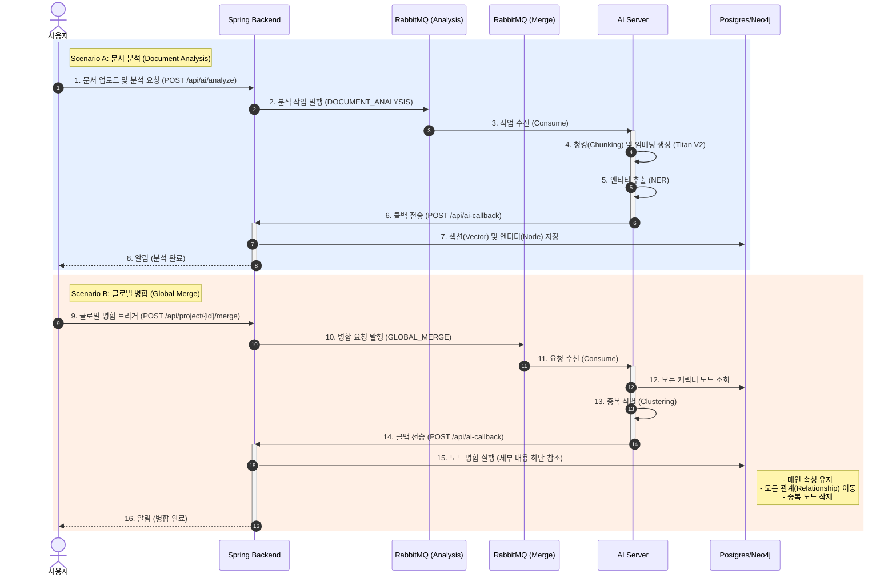

# 종단간(End-to-End) 연동 플로우: 문서 분석 및 글로벌 병합

이 문서는 **Spring Backend**와 **AI Server** 간의 데이터 처리 전체 수명 주기를 설명합니다.

## 🔄 시퀀스 다이어그램 (Sequence Diagram)

---

## 📝 상세 단계 (Detailed Steps)

### Phase 1: 문서 분석 (Scenario A)
1.  **요청 (Request)**: 사용자가 특정 문서(챕터)에 대한 분석을 요청합니다.
2.  **큐잉 (Queuing)**: Backend가 `document_analysis_queue`에 분석 작업을 보냅니다.
3.  **AI 처리 (AI Processing)**:
    *   **청킹 (Chunking)**: 텍스트를 의미 단위로 쪼갭니다 (Semantic Chunking).
    *   **임베딩 (Embedding)**: 텍스트 조각을 1024차원 벡터로 변환합니다.
    *   **추출 (Extraction)**: 등장인물, 장소, 사건 등을 찾아냅니다.
4.  **콜백 (Callback)**: AI가 분석 결과를 Backend로 다시 보냅니다.
5.  **저장 (Persistence)**:
    *   **PostgreSQL**: `Section` 테이블에 벡터 데이터와 함께 저장합니다.
    *   **Neo4j**: 추출된 모든 엔티티에 대해 새로운 노드를 생성합니다 (이 단계에서는 중복이 존재할 수 있음).

### Phase 2: 글로벌 병합 (Scenario B)
1.  **트리거 (Trigger)**: 사용자(또는 배치 작업)가 프로젝트 전체에 대한 병합을 요청합니다.
2.  **AI 분석 (AI Analysis)**:
    *   AI가 Phase 1에서 생성된 모든 캐릭터 노드를 읽어옵니다.
    *   이름 유사도와 문맥을 분석하여 중복 그룹을 식별합니다 (예: "해리", "해리 포터", "포터 군" → 동일 인물).
    *   **대표(Primary) ID**를 선정합니다.
3.  **병합 실행 (Merge Execution - Spring)**:
    *   AI로부터 `{ keep: primary_id, merge: [old_id1, old_id2] }` 형태의 리스트를 받습니다.
    *   **동작**: Neo4j의 `mergeNodes(primary, old)`를 호출합니다.
    *   **결과**: `old_id`가 가지고 있던 모든 관계(누가 누구를 만났고, 어디에 갔는지 등)가 `primary_id`로 옮겨집니다. 그래프가 깔끔하게 하나로 연결됩니다.
